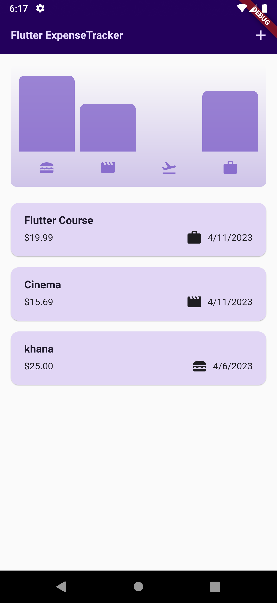
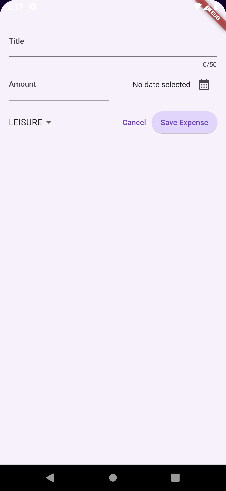

# Expenses App

## Overview

The Expenses App is a simple and easy-to-use mobile application designed to help you keep track of your expenses. With its intuitive user interface and powerful features, you can easily create and manage your expense records, categorize them, and view detailed reports withBars.

## Features

* Add new expenses with ease
* Categorize your expenses
* View detailed reports of your expenses
* Beautiful and intuitive user interface

## Screenshots

 

## Download APK

You can download the latest version of the APK from the following link:

[Download APK]([https://example.com/path/to/apk/file.apk](https://drive.google.com/uc?export=download&id=17TYQWUfzVoTq0mumcxeV0AhxfpWptDXb)) ⬇️

## Usage

1. Launch the Expenses App
2. Tap on the "Add Expense" button to add a new expense
3. Enter the details of your expense, including the amount, date, and category
4. Tap on the "Save" button to save your expense
5. View your expenses by tapping on the "Expenses" tab
6. View your expense reports on the "Chart-Bars" tab

## License

The Expenses App is released under the [MIT License](https://opensource.org/licenses/MIT).
